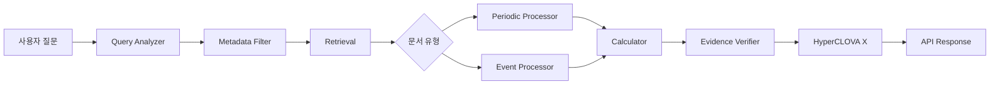

# 예정 아키텍처

아래는 MVP가 지향하는 논리 흐름이며 현재 기능은 구현되어 있지 않습니다.

```mermaid
flowchart LR
    Q[사용자 질문] --> QA[Query Analyzer]
    QA --> MF[Metadata Filter]
    MF --> R[Retrieval]
    R --> P{문서 유형}
    P --> PP[Periodic Processor]
    P --> EP[Event Processor]
    PP --> C[Calculator]
    EP --> C
    C --> EV[Evidence Verifier]
    EV --> HCX[HyperCLOVA X]
    HCX --> API[API Response]
```

각 노드는 팀 간 경계를 정하기 위한 예정 구성요소입니다. 데이터 계약을 먼저 확정한 후 각
담당자가 구현하며, 현재 scaffold에는 실행 로직이 없습니다.
